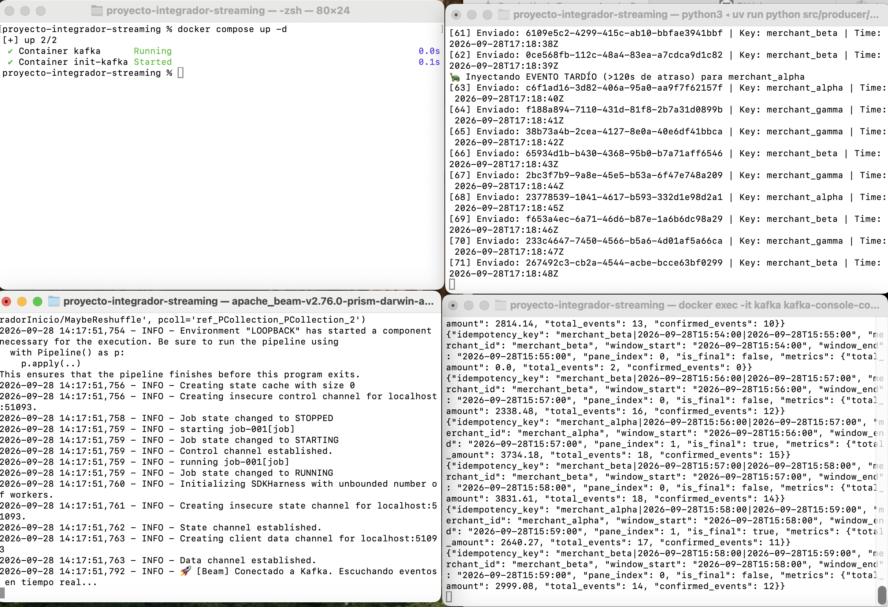

# Pipeline de Streaming Idempotente y Deduplicación en Tiempo Real

Proyecto de procesamiento en streaming end-to-end construido con **Apache Kafka** y **Apache Beam (Python)**, enfocado en el manejo riguroso de *Event Time*, deduplicación por ventana y estrategias de sumidero idempotente (`UPSERT`).

---

---

---

## 👥 Integrantes y Contribuciones

* **Diego Olmedo**
  * Diseño del contrato de eventos, infraestructura Kafka (Docker) y productor sintético de anomalías.
  * Desarrollo del pipeline principal en Apache Beam (Event Time, Windows, CombineFn y deduplicación).

* **Nelson Castelvi**
  * Diseño del contrato de eventos, infraestructura Kafka (Docker) y productor sintético de anomalías.
  * Implementación de la clave idempotente UPSERT, suite de pruebas unitarias con Pytest y documentación técnica.

## 🏗️ Arquitectura de la Solución

```text
[ Producer ] ---> ( Kafka: events.v1 ) ---> [ Apache Beam Pipeline ] ---> ( Kafka: aggregates.v1 )
(Inyector de                                - Event Time Windowing       (Formato Idempotente
 anomalías)                                  - Deduplicación por Key      UPSERT)
                                             - Allowed Lateness 120s

```

### Componentes clave:

* **Tópicos Kafka**:
* `events.v1` (2 particiones): Entrada de eventos de transacciones crudas.
* `aggregates.v1` (2 particiones): Métricas agregadas emitidas por ventana.
* `events.dlq.v1` (1 partición): Dead Letter Queue para eventos corruptos o no parseables.


* **Contrato de Evento**:
* `event_id`: Identificador único para deduplicación.
* `event_time`: Timestamp de origen en formato ISO-8601 (utilizado para el procesamiento por Event Time).
* `key`: `merchant_id` para garantizar particionamiento por entidad.


---

## 🛠️ Requisitos Previos

* **Docker** y **Docker Compose**
* **Python 3.10+**
* Gestor de paquetes **`uv`** (o `pip`)

---

## 🚀 Guía de Ejecución Paso a Paso

### 1. Levantar Infraestructura Kafka

```bash
docker compose up -d

```

*Verifica que los tópicos se hayan creado correctamente:*

```bash
docker compose ps

```

### 2. Iniciar el Productor de Eventos (Simulador)

En una terminal:

```bash
uv run python src/producer/producer.py

```

*El productor generará un flujo constante de pagos, inyectando periódicamente eventos duplicados (`10%`) y eventos tardíos/fuera de orden (`15%`).*

### 3. Ejecutar el Pipeline de Apache Beam

En una segunda terminal:

```bash
uv run python src/pipeline/main.py

```

*El pipeline aplicará ventanas fijas de 60s, filtrará los `event_id` repetidos dentro de cada ventana y gestionará los eventos atrasados mediante `allowed_lateness=120`.*

### 4. Inspeccionar los Resultados Procesados

En una tercera terminal, consume los datos del tópico de salida:

```bash
docker exec -it kafka kafka-console-consumer --bootstrap-server localhost:9092 --topic aggregates.v1 --from-beginning

```

---

## 🧪 Ejecución de Pruebas Unitarias

Para correr la suite de pruebas automatizadas sobre las transformaciones de Beam:

```bash
uv run pytest -o pythonpath=. tests/

```

---

## 📐 Decisiones de Ingeniería y Patrones Aplicados

1. **Event Time vs Processing Time**: Se extrae `event_time` del payload para evitar sesgos causados por la latencia de red.
2. **Deduplicación por Ventana**: Implementada en un `CombineFn` personalizado manteniendo un conjunto en memoria de los `event_id` vistos en cada panel de la ventana.
3. **Estrategia UPSERT (Idempotencia)**: La clave emite la combinación determinista `merchant_id|window_start|window_end`. Cualquier re-procesamiento o actualización por llegada tardía (*late data*) sobreescribe el estado de la ventana en lugar de duplicar resultados.


---

## 📸 Evidencia de Pruebas y Ejecución End-to-End

## Evidencia de Ejecución


### 1. Ejecución de Pruebas Unitarias Automatizadas
Validación de la lógica de negocio, deduplicación dentro de la ventana y filtrado de estados de pago mediante `pytest`:

```text
$ uv run pytest -o pythonpath=. tests/
============================== test session starts ==============================
platform darwin -- Python 3.12.x, pytest-9.x.x
rootdir: /path/to/proyecto
collected 2 items

tests/test_pipeline.py ..                                                 [100%]

=============================== 2 passed in 1.42s ===============================
